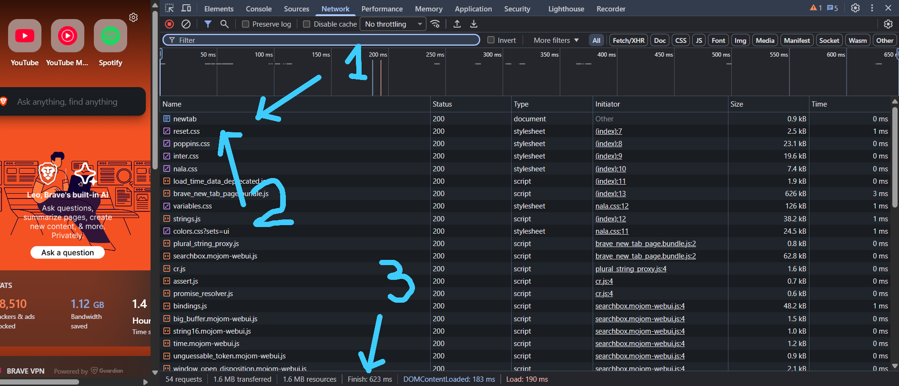
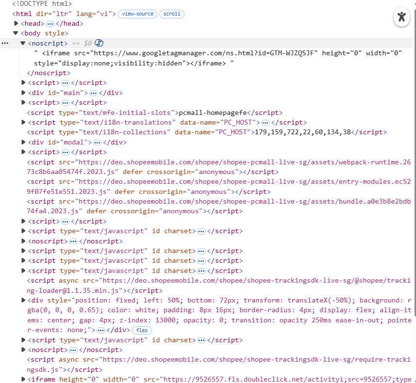
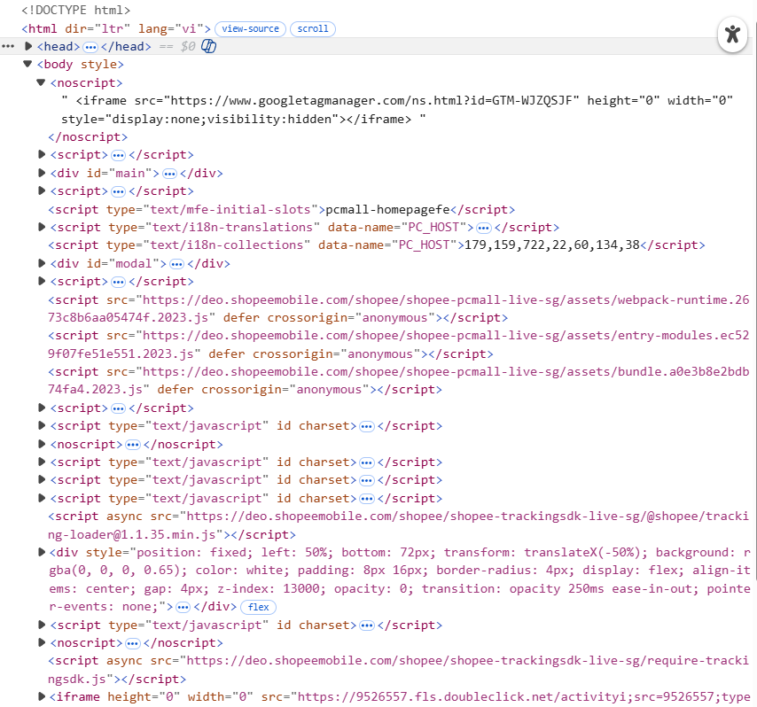
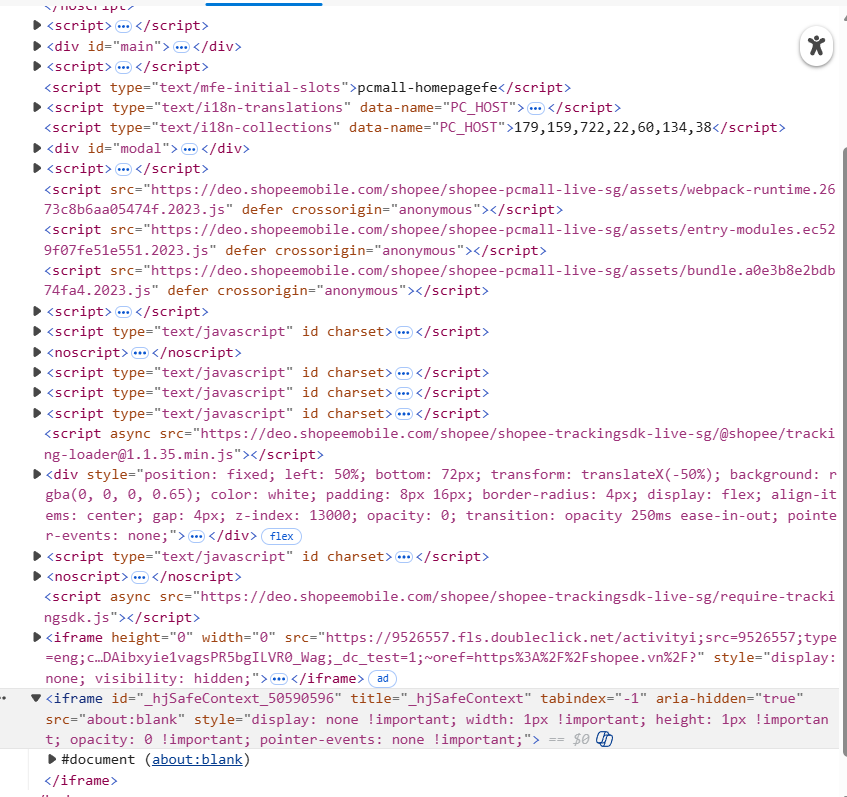
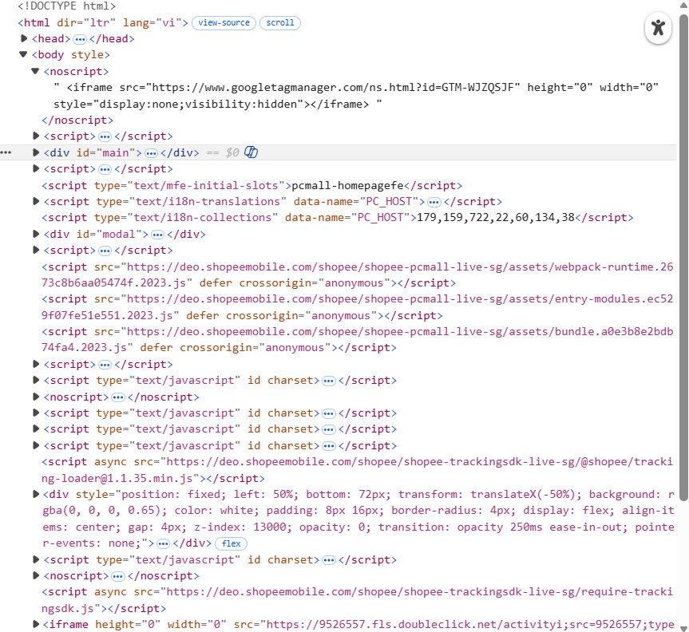
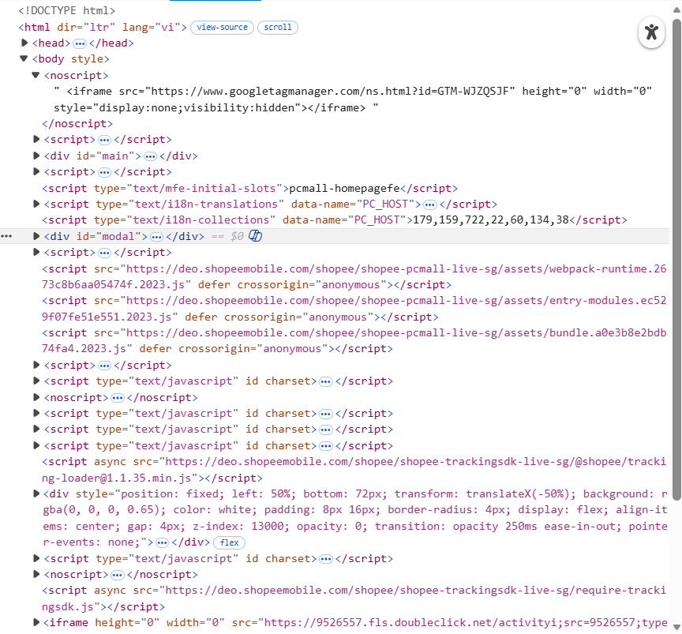

# PHIẾU BÀI TẬP 01
## Phần A
## Câu A1
I.
1.DNS Lookup
Trình duyệt gửi yêu cầu đến DNS server để phân giải tên miền shopee.vn thành địa chỉ IP của máy chủ, từ đó biết cần kết nối đến server nào trên Internet.
2.Thiết lập kết nối (TCP + TLS)
Trình duyệt thiết lập kết nối TCP với server, sau đó thực hiện TLS handshake để tạo kết nối HTTPS an toàn và mã hóa dữ liệu truyền đi.
3.Gửi HTTP Request
Sau khi kết nối thành công, trình duyệt gửi một HTTP request (thường là phương thức GET) đến server để yêu cầu nội dung trang web.
4.Server xử lý và trả về Response
Server nhận request, xử lý logic cần thiết và trả về HTTP response bao gồm mã trạng thái (ví dụ 200 OK) và nội dung HTML của trang.
5.Trình duyệt render trang web
Trình duyệt phân tích HTML để tạo DOM, tải thêm CSS và JavaScript, sau đó kết hợp lại để hiển thị giao diện hoàn chỉnh cho người dùng.

nguồn tham chiếu: 01_introduction_html_universe.md + Cuộc Hành Trình 0.3 Giây Xuyên Đại Dương
II.

## Câu A2
Trả lời:
- do trang web sử dụng quá nhiều 
 không có semantic
Liệt kê các lỗi:
Lỗi 1:
Không dùng thẻ header 
`

Lỗi 2:
Menu không dùng <nav>

Lỗi 3:
Không dùng <main>

Lỗi 4:
Không dùng thẻ tiêu đề <h1>, <h2>

iPhone 16 Pro

Lỗi 5:
Ảnh thiếu thuộc tính alt

Code đã sửa:
<header>
    
ShopTLU

    <nav>
        <a href="/">Trang chủ</a>
        <a href="/products">Sản phẩm</a>
    </nav>
</header>

<main>
    

        <h2>iPhone 16 Pro</h2>
        
25.990.000đ

        
</main>

© 2026 ShopTLU

## Câu A3
┌─────────────┐
│   Hộp 1     │  ← div: chiếm cả hàng
└─────────────┘
Text A Text B     ← span: nằm cùng hàng nhau
┌─────────────┐
│   Hộp 2     │  ← div: xuống hàng mới
└─────────────┘
Text C **Text D**  ← span + strong: cùng hàng, Text D in đậm
┌─────────────┐
│   Hộp 3     │  ← div: xuống hàng mới
└─────────────┘
## Câu A4
Phân biệt <thead>, <tbody>, <tfoot>
<thead>: tiêu đề bảng
<tbody>: dữ liệu chính
<tfoot>: phần tổng kết
Vì sao không nên dùng <table> để layout?
Sai ngữ nghĩa: <table> dùng cho dữ liệu bảng → ảnh hưởng SEO và accessibility
Khó bảo trì: code lồng nhiều <tr>, <td>, khó đọc và sửa
Hiệu năng kém: trình duyệt phải xử lý toàn bộ bảng trước khi render.

## Phần B

## Câu B3
Lỗi 1: Dòng 1 — <!DOCTYPE> sai cú pháp — Sửa thành <!DOCTYPE html>

Lỗi 2: Dòng 2 — <html> thiếu thuộc tính lang — Thêm lang="vi"

Lỗi 3: Dòng 4 — <title> không đóng — Thêm </title>

Lỗi 4: Dòng 5 — charset viết sai "utf8" — Sửa thành "UTF-8"

Lỗi 5: Dòng 8 — <h1> không đóng đúng — Sửa </h1>

Lỗi 6: Dòng 12 — <a href="home"> thiếu dấu đóng </a>

Lỗi 7: Dòng 12 — link "home" không đúng chuẩn — Sửa thành "#" hoặc "/"

Lỗi 8: Dòng 18 —  thiếu dấu ngoặc kép và alt — Thêm src="iphone.jpg" alt="iPhone"

Lỗi 9: Dòng 20 — thẻ <b> đóng sai vị trí — Sửa thành <b>...</b> đúng thứ tự

Lỗi 10: Dòng 26 — <table> thiếu thead/tbody (semantic kém) — Thêm cấu trúc chuẩn

Lỗi 11: Dòng 35 — dùng 2 thẻ <main> (sai semantic) — Đổi cái thứ 2 thành <aside>

Lỗi 12: Dòng 40 — 
 không đóng — Thêm 

Lỗi 13: Toàn file — thiếu meta viewport — Thêm vào <head>

## Câu B4
3 thẻ semantic:

2 thẻ không dùng đúng semantic:

## Phần C
## Câu C1
<!DOCTYPE html>
<html lang="vi">
<head>
    <meta charset="UTF-8">
    <title>Chi tiết sản phẩm</title>
</head>
<body>

<header>
    <!-- header: chứa phần đầu trang (logo, menu) -->
    <nav>
        <!-- nav: khu vực điều hướng chính -->
        <a href="#">Trang chủ</a>
        <a href="#">Danh mục</a>
        <a href="#">Liên hệ</a>
    </nav>
</header>

<nav aria-label="breadcrumb">
    <!-- nav: breadcrumb là điều hướng -->
    <ol>
        <!-- ol: breadcrumb có thứ tự phân cấp -->
        <li><a href="#">Trang chủ</a></li>
        <li><a href="#">Điện thoại</a></li>
        <li>iPhone 16</li>
    </ol>
</nav>

<main>
    <!-- main: nội dung chính của trang -->

    <section>
        <!-- section: nhóm nội dung sản phẩm -->
        
        <article>
            <!-- article: sản phẩm là nội dung độc lập -->

            <figure>
                <!-- figure: nhóm các ảnh sản phẩm -->
                
                
                
                
                
                <figcaption>Ảnh sản phẩm</figcaption>
            </figure>

            <header>
                <!-- header: phần thông tin chính của sản phẩm -->
                <h1>Tên sản phẩm</h1>
                
Giá: <strong>...</strong>

                
Đánh giá: ⭐⭐⭐⭐☆

            </header>

            <section>
                <!-- section: mô tả sản phẩm -->
                <h2>Mô tả</h2>
                
Thông tin mô tả sản phẩm...

            </section>

        </article>

    </section>

    <section>
        <!-- section: bảng thông số kỹ thuật -->
        <h2>Thông số kỹ thuật</h2>
        <table>
            <!-- table: dữ liệu dạng bảng -->
            <thead>
                <tr>
                    <th>Thông số</th>
                    <th>Giá trị</th>
                </tr>
            </thead>
            <tbody>
                <tr>
                    <td>CPU</td>
                    <td>...</td>
                </tr>
            </tbody>
        </table>
    </section>

    <section>
        <!-- section: đánh giá và bình luận -->
        <h2>Đánh giá</h2>
        <article>
            <!-- article: mỗi bình luận là nội dung độc lập -->
            
Người dùng A: Sản phẩm tốt

        </article>
    </section>

</main>

<aside>
    <!-- aside: nội dung phụ (sidebar) -->
    <h2>Sản phẩm tương tự</h2>
    <article>
        <!-- article: mỗi sản phẩm tương tự -->
        
Sản phẩm 1

    </article>
</aside>

<footer>
    <!-- footer: thông tin cuối trang -->
    
© 2026 Shop

</footer>

</body>
</html>

## Câu C2
Đoạn văn:
Việc sử dụng semantic HTML không phải là “tốn thời gian”, mà là một yêu cầu cơ bản trong phát triển web hiện đại. Thứ nhất, về SEO, các công cụ tìm kiếm như Google dựa vào cấu trúc HTML để hiểu nội dung trang. Nếu mọi thứ đều dùng `
`, trình thu thập dữ liệu sẽ khó phân biệt đâu là nội dung chính, đâu là điều hướng, từ đó ảnh hưởng đến thứ hạng tìm kiếm. Ngược lại, việc sử dụng các thẻ như `<header>`, `<main>`, `<article>` giúp xác định rõ cấu trúc, cải thiện khả năng index.

Thứ hai, về accessibility, các thiết bị hỗ trợ như screen reader cần semantic HTML để đọc và diễn giải nội dung cho người dùng khiếm thị. Ví dụ, khi dùng `<nav>`, screen reader có thể thông báo “đây là khu vực điều hướng”, giúp người dùng hiểu và di chuyển dễ dàng hơn. Nếu chỉ dùng `
`, toàn bộ nội dung sẽ trở nên “vô nghĩa” đối với các công cụ này.

Một ví dụ cụ thể là breadcrumb: nếu sử dụng `<nav>` kết hợp `<ol>`, công cụ tìm kiếm và trình đọc màn hình đều hiểu đây là đường dẫn phân cấp. Điều này không thể đạt được nếu chỉ dùng `
`.

Tuy nhiên, `
` vẫn cần thiết trong một số trường hợp, ví dụ khi tạo layout hoặc nhóm các phần tử chỉ phục vụ cho CSS/JS mà không mang ý nghĩa nội dung. Vì vậy, nên kết hợp semantic HTML với `
` một cách hợp lý, thay vì thay thế hoàn toàn.
