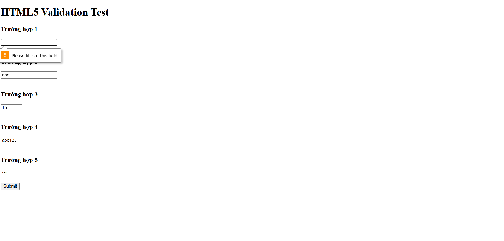
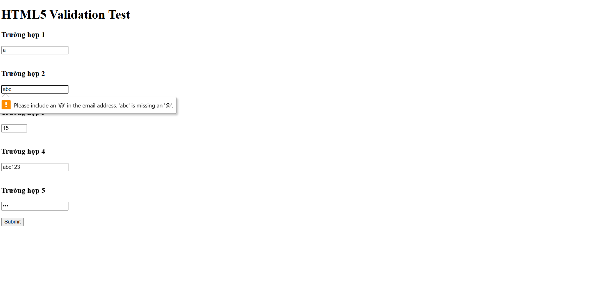
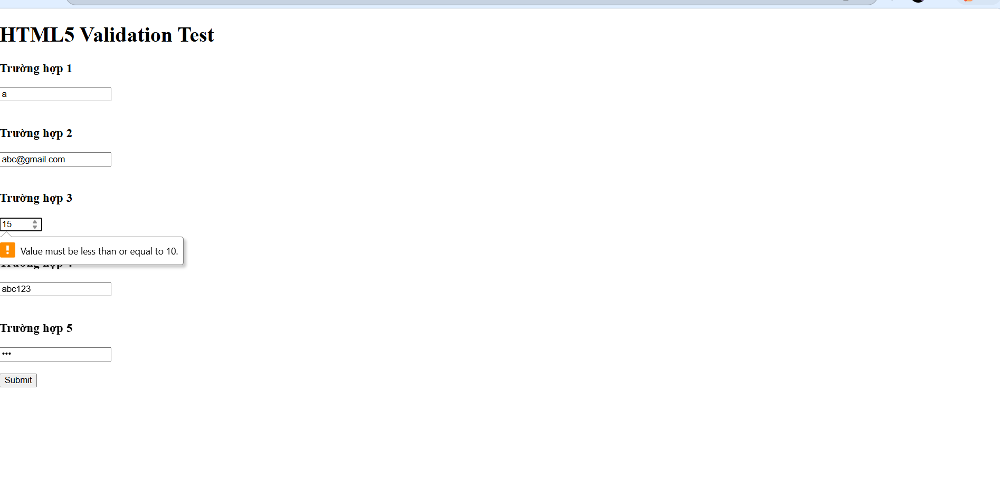
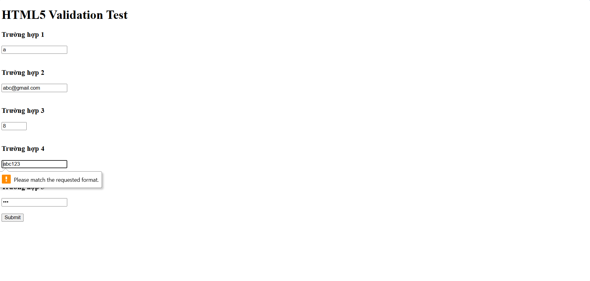

## Câu A1
1. type="text" → Ô nhập văn bản thông thường → Không có validation đặc biệt → Dùng để nhập tên khách hàng hoặc tên sản phẩm

2. type="email" → Ô nhập email → Tự kiểm tra có ký tự @ và đúng định dạng email → Dùng cho form đăng ký tài khoản

3. type="password" → Ô nhập mật khẩu, ký tự bị ẩn → Không validation tự động → Dùng cho đăng nhập tài khoản

4. type="number" → Ô nhập số có nút tăng/giảm → Chỉ cho nhập số → Dùng để nhập số lượng sản phẩm

5. type="tel" → Ô nhập số điện thoại → Không kiểm tra chặt nhưng tối ưu bàn phím điện thoại → Dùng cho form đặt hàng

6. type="date" → Hiển thị lịch chọn ngày → Kiểm tra định dạng ngày hợp lệ → Dùng để chọn ngày giao hàng

7. type="file" → Nút chọn file từ máy tính → Kiểm tra loại file nếu có accept → Dùng để upload ảnh đánh giá sản phẩm

8. type="checkbox" → Ô vuông tích chọn nhiều mục → Không validation mặc định → Dùng để chọn đồng ý điều khoản

9. type="radio" → Nút chọn một trong nhiều lựa chọn → Chỉ chọn được 1 option → Dùng để chọn phương thức thanh toán

10. type="search" → Ô tìm kiếm có nút xóa nhanh → Không validation đặc biệt → Dùng cho thanh tìm kiếm sản phẩm

## Câu A2

Trường hợp 1:
```html
<input type="text" required value="">
```

Kết quả:
Form không submit được.

Lý do:
Thuộc tính required bắt buộc người dùng phải nhập dữ liệu. Ô input đang để trống nên trình duyệt báo lỗi.


Trường hợp 2:
```html
<input type="email" value="abc">
```
Kết quả:
Form không submit được.

Lý do:
type="email" yêu cầu dữ liệu đúng định dạng email. Giá trị "abc" không có ký tự @ nên validation thất bại.


Trường hợp 3:
```html
<input type="number" min="1" max="10" value="15">
```
Kết quả:
Form không submit được.

Lý do:
Giá trị 15 vượt quá max="10". Trình duyệt báo giá trị phải nằm trong khoảng 1 đến 10.


Trường hợp 4:
```html
<input type="text" pattern="[0-9]{10}" value="abc123">
```
Kết quả:
Form không submit được.

Lý do:
pattern="[0-9]{10}" yêu cầu đúng 10 chữ số liên tiếp. Giá trị "abc123" chứa chữ cái và không đủ 10 số.


Trường hợp 5:
```html
<input type="password" minlength="8" value="123">
```
Kết quả:
Form không submit được.

Lý do:
minlength="8" yêu cầu mật khẩu có ít nhất 8 ký tự. Giá trị "123" chỉ có 3 ký tự nên không hợp lệ.
# Hình ảnh




# Nhận xét
Kết quả thực tế giống với dự đoán. 
Trình duyệt HTML5 tự động kiểm tra dữ liệu và chặn submit khi input không hợp lệ.

## Câu A3

1. Tại sao `<label for="email">` quan trọng cho screen reader?

<label> giúp screen reader đọc tên của ô input cho người khiếm thị. 
Khi dùng thuộc tính for liên kết với id của input, screen reader sẽ hiểu ô đó dùng để nhập gì.

Ví dụ:
```html
<label for="email">Email</label>
<input type="email" id="email">
```
Khi người dùng di chuyển tới ô input, screen reader sẽ đọc:
“Email, edit text”

Ngoài accessibility, người dùng cũng có thể click vào chữ “Email” để focus vào ô input.


2. Khi nào dùng `<fieldset>` + `<legend>`?

Dùng khi cần nhóm nhiều input liên quan với nhau trong cùng một phần form.

`<fieldset>` dùng để nhóm.
`<legend>` là tiêu đề của nhóm đó.

Ví dụ:
```html
<fieldset>
    <legend>Thông tin thanh toán</legend>

    <input type="radio" name="pay"> Tiền mặt
    <input type="radio" name="pay"> Chuyển khoản
</fieldset>
```
Screen reader sẽ hiểu đây là một nhóm input cùng chủ đề, giúp người dùng dễ theo dõi hơn.


3. aria-label dùng khi nào? Tại sao không nên dùng khi đã có `<label>`?

aria-label dùng khi không có text hiển thị nhưng vẫn cần mô tả cho screen reader.

Ví dụ nút chỉ có icon:
```html
<button aria-label="Tìm kiếm">
    🔍
</button>
```
Không nên dùng aria-label khi đã có `<label>` vì:
- dễ bị trùng nội dung
- gây khó hiểu cho screen reader
- HTML semantic tự nhiên luôn được ưu tiên hơn ARIA

Nếu đã có:
```html
<label for="email">Email</label>
```
thì không cần thêm aria-label nữa.

## Câu A4

1. Thuộc tính loading="lazy" trên ``

loading="lazy" giúp trình duyệt chỉ tải ảnh khi người dùng cuộn gần tới ảnh đó, thay vì tải toàn bộ ảnh ngay khi mở trang.

Ví dụ:

``

Lợi ích:
- Giảm thời gian tải trang
- Tiết kiệm băng thông
- Tăng hiệu năng cho website có nhiều ảnh

Không nên dùng:
- Ảnh logo
- Ảnh banner đầu trang
- Ảnh xuất hiện ngay khi mở website

Vì các ảnh này cần tải ngay để tránh trang hiển thị chậm hoặc bị trống hình.


2. Tại sao nên cung cấp nhiều `<source>` trong `<video>`?

Mỗi trình duyệt hỗ trợ format video khác nhau. 
Dùng nhiều `<source>` giúp video chạy được trên nhiều browser và thiết bị.

Ví dụ:
```html
<video controls>
    <source src="video.mp4" type="video/mp4">
    <source src="video.webm" type="video/webm">
</video>
```
Một số format video phổ biến:
- MP4
- WebM
- OGG


3. Thuộc tính alt trên `` dùng để làm gì?

alt dùng để mô tả nội dung ảnh cho:
- screen reader
- trường hợp ảnh bị lỗi không hiển thị
- hỗ trợ SEO

Ví dụ alt tốt:

a Ảnh sản phẩm iPhone 16

alt="iPhone 16 Pro màu titan đen"

b Ảnh trang trí (decorative)

alt=""

c Ảnh biểu đồ doanh thu Q1/2026

alt="Biểu đồ doanh thu quý 1 năm 2026 tăng từ tháng 1 đến tháng 3"

## Câu A5

Cách 1 chỉ dùng thẻ `` phù hợp khi ảnh chỉ mang tính hiển thị đơn giản, không cần chú thích hay mô tả thêm.

Ví dụ thực tế:
- Logo website ở header
- Icon sản phẩm hoặc icon mạng xã hội


Cách 2 dùng `<figure>` + `<figcaption>` phù hợp khi ảnh cần có chú thích, mô tả hoặc liên quan trực tiếp đến nội dung bài viết.

Ví dụ thực tế:
- Ảnh sản phẩm có tên và giá trong trang E-Commerce
- Ảnh minh họa trong bài báo hoặc blog có caption giải thích


Khác nhau chính:
- `` chỉ hiển thị ảnh
- `<figure>` giúp nhóm ảnh và phần mô tả thành một nội dung semantic hoàn chỉnh
- `<figcaption>` cung cấp chú thích cho người dùng và screen reader

## Câu C1

Lỗi 1: Dòng 2 — Input "Tên" không có `<label for="">` và thiếu `id/name`  
Sửa:  
`<label for="name">Tên:</label>`  
`<input type="text" id="name" name="name" required>`


Lỗi 2: Dòng 2 — Input tên không có `required` nên user có thể để trống  
Sửa:  
`<input type="text" id="name" name="name" required>`


Lỗi 3: Dòng 4 — Input email không có label accessibility  
Sửa:  
`<label for="email">Email:</label>`  
`<input type="email" id="email" name="email" placeholder="Email của bạn" required>`


Lỗi 4: Dòng 6-7 — Hai ô password không có label riêng biệt  
Sửa:  
`<label for="password">Mật khẩu:</label>`  
`<input type="password" id="password" name="password">`  

`<label for="confirm-password">Nhập lại mật khẩu:</label>`  
`<input type="password" id="confirm-password" name="confirm-password">`


Lỗi 5: Dòng 6 — Password không có `minlength` nên mật khẩu quá ngắn vẫn hợp lệ  
Sửa:  
`<input type="password" id="password" name="password" minlength="8" required>`


Lỗi 6: Dòng 9 — Số điện thoại dùng `type="text"` thay vì `type="tel"`  
Sửa:  
`<label for="phone">Phone:</label>`  
`<input type="tel" id="phone" name="phone" pattern="[0-9]{10}">`


Lỗi 7: Dòng 11 — `<select>` không có label và không có `name`  
Sửa:  
`<label for="city">Thành phố:</label>`  

```html
<select id="city" name="city">
    <option>Hà Nội</option>
    <option>TP.HCM</option>
</select>
```

## Câu C2

### 1. Pattern regex

CMND/CCCD (đúng 12 chữ số):

```html
pattern="[0-9]{12}"
```

Hoặc regex đầy đủ:

```regex
^[0-9]{12}$
```


Số tài khoản ngân hàng (10-15 chữ số):

```html
pattern="[0-9]{10,15}"
```

Hoặc regex đầy đủ:

```regex
^[0-9]{10,15}$
```


PIN 6 chữ số:

```html
<input type="password" pattern="[0-9]{6}">
```


---

### 2. HTML5 validation có đủ an toàn cho ứng dụng ngân hàng không?

Không đủ an toàn.

HTML5 validation chỉ hoạt động phía frontend (trình duyệt). Người dùng có thể:
- tắt validation
- sửa HTML bằng DevTools
- gửi request giả bằng Postman hoặc script

Vì vậy backend vẫn bắt buộc phải validate lại toàn bộ dữ liệu trước khi xử lý.


---

### 3. Ba loại validation HTML5 KHÔNG THỂ làm được

1. So sánh 2 trường dữ liệu  
Ví dụ:
- confirm password phải giống password

2. Kiểm tra dữ liệu tồn tại trong database  
Ví dụ:
- email đã đăng ký chưa
- số tài khoản có hợp lệ không

3. Validation logic phức tạp  
Ví dụ:
- user phải trên 18 tuổi
- tổng tiền giao dịch vượt hạn mức


---

### 4. Hai rủi ro bảo mật nếu chỉ validate Frontend

1. Bypass validation  
Kẻ tấn công có thể gửi dữ liệu sai trực tiếp tới server mà không qua form HTML.

2. Injection attack  
Nếu backend không kiểm tra dữ liệu, hacker có thể chèn mã độc như:
- SQL Injection
- XSS

gây rò rỉ hoặc phá hủy dữ liệu hệ thống.