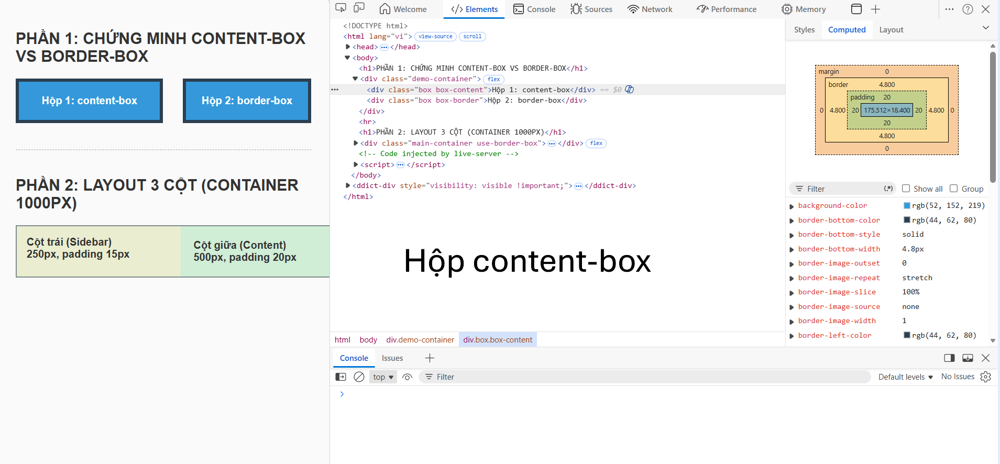
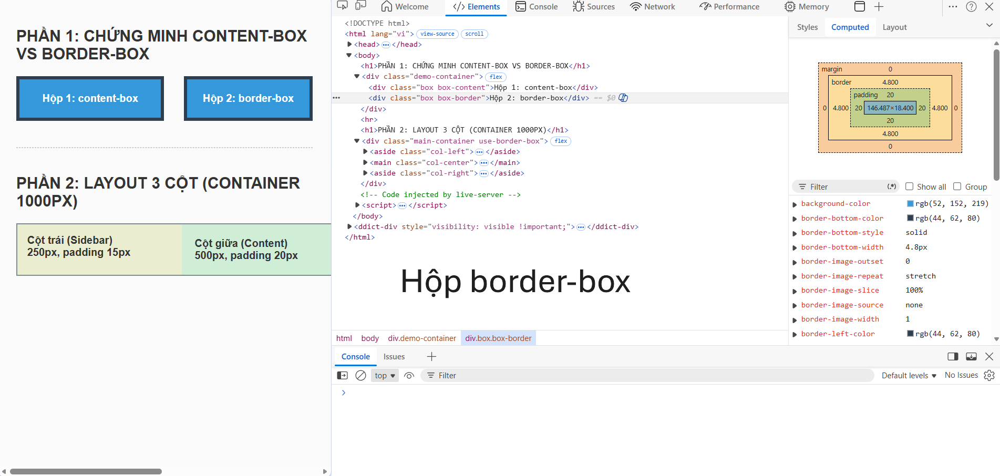
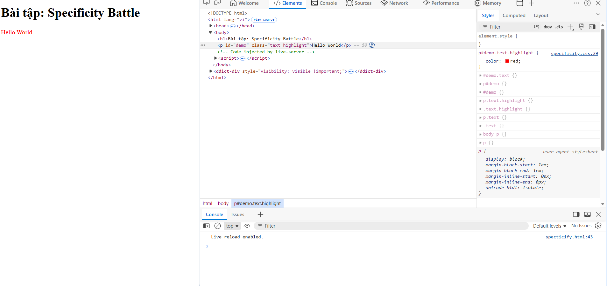

## Câu A1

## 1. Inline CSS

Viết CSS trực tiếp trong thẻ HTML bằng thuộc tính `style`.

Ví dụ:

```html
<p style="color: red;">Hello CSS</p>
```

Ưu điểm:
- Nhanh
- Dễ test nhanh một style nhỏ

Nhược điểm:
- Code khó bảo trì
- Lặp code nhiều
- Không tách riêng giao diện và nội dung

Khi nên dùng:
- Test nhanh
- Style nhỏ, tạm thời


---

## 2. Internal CSS

Viết CSS trong thẻ `<style>` bên trong file HTML.

Ví dụ:

```html
<head>
    <style>
        p {
            color: blue;
        }
    </style>
</head>
```

Ưu điểm:
- Quản lý CSS tập trung hơn inline
- Không cần file riêng

Nhược điểm:
- File HTML dễ dài và rối
- Không tái sử dụng cho nhiều trang

Khi nên dùng:
- Website nhỏ
- Trang demo hoặc bài thực hành


---

## 3. External CSS

Viết CSS trong file `.css` riêng và liên kết bằng `<link>`.

Ví dụ:

```html
<head>
    <link rel="stylesheet" href="style.css">
</head>
```

File `style.css`:

```css
p {
    color: green;
}
```

Ưu điểm:
- Code sạch
- Dễ bảo trì
- Tái sử dụng cho nhiều trang
- Chuẩn thực tế khi làm project

Nhược điểm:
- Cần quản lý thêm file CSS

Khi nên dùng:
- Hầu hết project thực tế
- Website nhiều trang


---

## Câu hỏi thêm

Nếu cùng một element có cả Inline, Internal và External CSS cùng áp dụng thì:

Inline CSS sẽ thắng.

Ví dụ:

```html
<p style="color:red;">Hello</p>
```

```css
p {
    color: blue;
}
```

Kết quả cuối cùng:
- chữ màu đỏ

Lý do:
- Inline CSS có độ ưu tiên (specificity) cao hơn Internal và External CSS.
- Thứ tự ưu tiên thường là:

```text
Inline > Internal > External
```

## Câu A2

1. `h1`  
→ Chọn: `ShopTLU`


2. `.price`  
→ Chọn:
- `25.990.000đ`
- `45.990.000đ`


3. `#app header`  
→ Chọn toàn bộ thẻ `<header>` bên trong `id="app"` gồm:
- `ShopTLU`
- `Home`
- `Products`
- `About`


4. `nav a:first-child`  
→ Chọn: `Home`


5. `.product.featured h2`  
→ Chọn: `MacBook Pro`


6. `article > p`  
→ Chọn:
- `25.990.000đ`
- `Mô tả sản phẩm...`
- `45.990.000đ`
- `Mô tả sản phẩm...`

(Vì selector chọn mọi thẻ `<p>` là con trực tiếp của `<article>`)


7. `a[href="/"]`  
→ Chọn: `Home`


8. `.top-bar.dark h1`  
→ Chọn: `ShopTLU`

# CÂU A3 

## 1. Trường hợp 1: content-box (mặc định)

### Cấu trúc thông số:
* `width`: 400px (chỉ tính riêng cho phần nội dung - content)
* `padding`: 20px (áp dụng cho cả 4 cạnh: trên, dưới, trái, phải)
* `border`: 5px (áp dụng cho cả 4 cạnh: trên, dưới, trái, phải)
* `margin`: 10px (áp dụng cho cả 4 cạnh: trên, dưới, trái, phải)

### Tính toán:
* **Chiều rộng hiển thị (Visual Width):** $$\text{Width} + \text{Padding Left} + \text{Padding Right} + \text{Border Left} + \text{Border Right}$$
  $$\rightarrow 400\text{px} + 20\text{px} + 20\text{px} + 5\text{px} + 5\text{px} = 450\text{px}$$
* **Không gian chiếm trên trang (Total Space):** $$\text{Chiều rộng hiển thị} + \text{Margin Left} + \text{Margin Right}$$
  $$\rightarrow 450\text{px} + 10\text{px} + 10\text{px} = 470\text{px}$$

### Kết quả:
* **Chiều rộng hiển thị** = 450px
* **Không gian chiếm trên trang** = 470px

---

## 2. Trường hợp 2: border-box

### Cấu trúc thông số:
* `width`: 400px (đây là tổng chiều rộng hiển thị cố định bao gồm cả nội dung, padding và border)
* `padding`: 20px (mỗi bên)
* `border`: 5px (mỗi bên)
* `margin`: 10px (mỗi bên)

### Tính toán:
* **Chiều rộng hiển thị (Visual Width):** Bằng chính giá trị `width` được thiết lập khi dùng `border-box` $\rightarrow$ 400px.
* **Kích thước content thực tế:** $$\text{Width tổng} - (\text{Padding Left} + \text{Padding Right}) - (\text{Border Left} + \text{Border Right})$$
  $$\rightarrow 400\text{px} - (20\text{px} + 20\text{px}) - (5\text{px} + 5\text{px}) = 350\text{px}$$
* **Không gian chiếm trên trang (Total Space):** $$\text{Chiều rộng hiển thị} + \text{Margin Left} + \text{Margin Right}$$
  $$\rightarrow 400\text{px} + 10\text{px} + 10\text{px} = 420\text{px}$$

### Kết quả:
* **Chiều rộng hiển thị** = 400px
* **Kích thước content thực tế** = 350px
* **Không gian chiếm trên trang** = 420px

---

## 3. Trường hợp 3: Margin collapse

### Kết quả:
* **Khoảng cách giữa box-a và box-b** = 40px

### Giải thích tại sao KHÔNG PHẢI 65px:
Trong CSS, khi hai phần tử khối (block-level elements) nằm chồng lên nhau theo chiều dọc, hiện tượng **Margin Collapse (Sụp đổ lề)** sẽ xảy ra. Thay vì cộng dồn hai khoảng cách lề lại với nhau ($25\text{px} + 40\text{px} = 65\text{px}$), trình duyệt sẽ so sánh lề dưới của phần tử trên và lề trên của phần tử dưới, sau đó **chỉ giữ lại giá trị lề lớn nhất**. 
Vì $\text{40px} > \text{25px}$, nên trình duyệt chọn 40px làm khoảng cách thực tế giữa hai khối.

---

## 4. Phần nâng cao (Margin âm)

### Tính toán:
Khi xảy ra hiện tượng sụp đổ lề (Margin collapse) giữa một lề dương và một lề âm, quy định của CSS là lấy **giá trị lề dương lớn nhất cộng với giá trị lề âm nhỏ nhất**.

* Phép tính: $$40\text{px} + (-10\text{px}) = 30\text{px}$$

### Kết quả nâng cao:
* **Khoảng cách thực tế** = 30px *(Lúc này `box-b` sẽ bị kéo dịch lên phía trên và đè lên vùng không gian của `box-a` một khoảng là 10px)*.

# CÂU A4 

## 1. Tính toán Specificity Score (a, b, c)

Để tính toán độ ưu tiên của CSS, chúng ta sử dụng hệ số bộ ba **(a, b, c)** theo quy tắc tính từ trái sang phải:
* **a (ID selectors):** Số lượng định danh `id` (Ví dụ: `#main-price`). Có điểm số cao nhất.
* **b (Class/Attribute/Pseudo-class):** Số lượng `class`, thuộc tính hoặc giả lớp (Ví dụ: `.price`).
* **c (Type/Element/Pseudo-element):** Số lượng thẻ HTML (Ví dụ: `p`). Có điểm số thấp nhất.


Áp dụng quy tắc trên cho từng Rule:

* **Rule A (`p`):** Chỉ chứa 1 thẻ `p` $\rightarrow$ Score: **(0, 0, 1)**
* **Rule B (`.price`):** Chỉ chứa 1 class `.price` $\rightarrow$ Score: **(0, 1, 0)**
* **Rule C (`#main-price`):** Chỉ chứa 1 id `#main-price` $\rightarrow$ Score: **(1, 0, 0)**
* **Rule D (`p.price`):** Chứa 1 thẻ `p` và 1 class `.price` $\rightarrow$ Score: **(0, 1, 1)**

---

## 2. Màu sắc hiển thị của Element và Giải thích

* **Kết quả:** Element `<p>` sẽ có **màu đỏ (red)**.
* **Giải thích:** Trình duyệt sẽ so sánh các điểm số Specificity từ trái qua phải. 
    * Xét cột **a (ID)**: Rule C có điểm bằng $1$ (vì dùng ID), trong khi các Rule A, B, D đều bằng $0$. 
    * Vì $1 > 0$, Rule C (`#main-price`) có độ ưu tiên cao nhất tuyệt đối bất kể các Rule khác có bao nhiêu class hay thẻ đi chăng nữa. Do đó thuộc tính `color: red;` được áp dụng.

---

## 3. Nếu thêm thuộc tính `style="color: orange;"` trực tiếp vào thẻ HTML

* **Kết quả:** Element sẽ chuyển sang **màu cam (orange)**.
* **Giải thích:** Thuộc tính viết trực tiếp trong thẻ HTML được gọi là **Inline Style**. Trong hệ thống phân cấp độ ưu tiên của CSS, Inline Style đứng trên cả ID selector (có thể coi điểm số của nó đứng ở một cột cao hơn là `(1, 0, 0, 0)`). Vì vậy, nó sẽ ghi đè hoàn toàn mã CSS viết trong file `.css` bên ngoài.

---

## 4. Nếu Rule A thêm `!important` (`p { color: black !important; }`)

* **Kết quả:** Element sẽ chuyển sang **màu đen (black)**.
* **Giải thích:** Từ khóa `!important` không phải là một selector nhưng nó là một "quân bài tẩy" trong CSS. Khi được gắn vào sau một giá trị thuộc tính, nó sẽ **phá vỡ mọi quy tắc tính điểm Specificity thông thường** và ép trình duyệt phải ưu tiên thuộc tính đó lên hàng đầu (cao hơn cả Inline Style và ID selector). Vì Rule A lúc này có `!important`, nó đánh bại hoàn toàn màu đỏ của ID và màu cam của Inline Style để hiển thị màu đen.

# Phần B
# Câu B1
---

## Danh sách 5 loại Selectors đã sử dụng trong file style.css để thiết kế trang Profile

Để đạt yêu cầu kỹ thuật tối ưu hóa mã nguồn, file `style.css` đã áp dụng thành công 5 loại Selector cốt lõi của CSS bao gồm:

1. **Universal Selector (Bộ chọn toàn cục):** * Cú pháp: `* { box-sizing: border-box; }`
   * Mục đích: Reset căn lề và định hình lại cách tính kích thước cho mọi thẻ trên trang web.
2. **Element Selector (Bộ chọn theo thẻ):** * Cú pháp: `body`, `header`, `table`, `footer`
   * Mục đích: Định dạng trực tiếp các thuộc tính hiển thị mặc định của thẻ HTML ngữ nghĩa.
3. **ID Selector (Bộ chọn theo định danh duy nhất):** * Cú pháp: `#contact`
   * Mục đích: Target duy nhất vào khối thông tin liên hệ nằm ở thẻ `<aside>` để tạo viền nhấn màu xanh.
4. **Descendant Selector (Bộ chọn phân cấp/con cháu):** * Cú pháp: `nav ul li a` hoặc `table thead tr`
   * Mục đích: Chỉ chọn các thẻ `<a>` nằm sâu trong cấu trúc thanh menu điều hướng mà không làm ảnh hưởng tới các liên kết khác trên trang.
5. **Pseudo-class Selector (Bộ chọn giả lớp theo trạng thái):** * Cú pháp: `nav ul li a:hover`, `table tbody tr:nth-child(even)`, `table tbody tr:hover`
   * Mục đích: Tạo hiệu ứng tương tác động (hover đổi màu) và thuật toán tô màu sọc dưa tự động cho bảng.
# Câu B2
# Hộp content-box

# Hộp border-box

---

## Kết quả thực hành file boxmodel_lab.html

### PHẦN 1 — CHỨNG MINH CONTENT-BOX VS BORDER-BOX

Dựa trên số liệu đo đạc trực tế từ công cụ DevTools (Tab Computed) sau khi click chính xác vào từng phần tử:

* **Hộp 1 (content-box):** Chiều rộng thực tế hiển thị trên browser = **350px**
  * *Thông số chi tiết từ sơ đồ DevTools:* Vùng lõi (content) = 300px | Padding = 20px * 2 | Border = 5px * 2.
  * *Công thức tính:* $$300\text{px (width)} + 40\text{px (padding)} + 10\text{px (border)} = 350\text{px}$$
* **Hộp 2 (border-box):** Chiều rộng thực tế hiển thị trên browser = **300px**
  * *Thông số chi tiết từ sơ đồ DevTools:* Vùng lõi (content) tự động thu hẹp còn 250px | Padding = 20px * 2 | Border = 5px * 2.
  * *Công thức tính:* $$250\text{px (content)} + 40\text{px (padding)} + 10\text{px (border)} = 300\text{px}$$

**Giải thích sự khác biệt:** * Thuộc tính `box-sizing: content-box` (mặc định) chỉ áp dụng kích thước `width` cho phần nội dung nằm bên trong. Do đó, khi ta thêm padding và border, kích thước tổng thể của hộp bị phình to ra ngoài, dễ gây lỗi vỡ giao diện khi dàn trang.
* Thuộc tính `box-sizing: border-box` ép trình duyệt phải tính toán sao cho kích thước tổng thể bao gồm cả viền ngoài cùng luôn cố định đúng bằng giá trị `width` khai báo ($300\text{px}$). Để làm được điều này, trình duyệt tự động bóp nhỏ vùng không gian chứa nội dung bên trong lại, giúp lập trình viên kiểm soát bố cục một cách chính xác tuyệt đối.

---

### PHẦN 2 — LAYOUT 3 CỘT (CONTAINER 1000PX)

Dựa trên các yêu cầu kỹ thuật của bài toán layout 3 cột:

* **Khi KHÔNG dùng border-box (Bị vỡ layout):** Mỗi cột khi tính toán thực tế đều bị cộng thêm padding vào chiều rộng khiến kích thước thật tăng lên:
  * Cột trái: $250\text{px} + 15\text{px} \times 2 = 280\text{px}$
  * Cột giữa: $500\text{px} + 20\text{px} \times 2 = 540\text{px}$
  * Cột phải: $250\text{px} + 15\text{px} \times 2 = 280\text{px}$
  $$\rightarrow \text{Tổng chiều rộng thực tế của 3 cột} = 280\text{px} + 540\text{px} + 280\text{px} = 1070\text{px}$$
  Vì tổng diện tích ($1070\text{px}$) vượt quá giới hạn của khung chứa `main-container` ($1000\text{px}$), cột bên phải (ads) không còn đủ chỗ trống để hiển thị nên bị trình duyệt đẩy rớt thẳng xuống dòng dưới, làm phá vỡ hoàn toàn cấu trúc layout.

* **Khi CÓ dùng border-box (Layout chuẩn xác):** Nhờ có thuộc tính `border-box`, kích thước của 3 cột được giữ cố định đúng như thiết kế, phần ruột tự co giãn để nhường chỗ cho lề đệm:
  * Cột trái hiển thị đúng: 250px (vùng nội dung tự co lại còn 220px)
  * Cột giữa hiển thị đúng: 500px (vùng nội dung tự co lại còn 460px)
  * Cột phải hiển thị đúng: 250px (vùng nội dung tự co lại còn 220px)
  $$\rightarrow \text{Tổng chiều rộng thực tế của 3 cột} = 250\text{px} + 500\text{px} + 250\text{px} = 1000\text{px}$$
  Kích thước tổng nằm vừa vặn, khít hoàn toàn với khung chứa $1000\text{px}$ giúp cả 3 cột hiển thị thẳng hàng, ngay ngắn trên cùng một dòng.
## Câu B3
---

## Kết quả thực hành file specificity.html (Specificity Battle)

### Bảng liệt kê 10 CSS Rules sắp xếp từ THẤP đến CAO:

| STT | CSS Rule | Màu sắc chỉ định | Thẻ (c) | Class (b) | ID (a) | Specificity Score |
| :--- | :--- | :--- | :---: | :---: | :---: | :---: |
| 1 | `p` | grey | 1 | 0 | 0 | **(0, 0, 1)** |
| 2 | `body p` | silver | 2 | 0 | 0 | **(0, 0, 2)** |
| 3 | `.text` | blue | 0 | 1 | 0 | **(0, 1, 0)** |
| 4 | `p.text` | green | 1 | 1 | 0 | **(0, 1, 1)** |
| 5 | `.text.highlight` | purple | 0 | 2 | 0 | **(0, 2, 0)** |
| 6 | `p.text.highlight` | brown | 1 | 2 | 0 | **(0, 2, 1)** |
| 7 | `#demo` | gold | 0 | 0 | 1 | **(1, 0, 0)** |
| 8 | `p#demo` | pink | 1 | 0 | 1 | **(1, 0, 1)** |
| 9 | `#demo.text` | cyan | 0 | 1 | 1 | **(1, 1, 0)** |
| 10 | `p#demo.text.highlight` | red | 1 | 2 | 1 | **(1, 2, 1)** |

### Câu hỏi 1: Element cuối cùng hiển thị màu gì? Tại sao?
* **Kết quả:** Phần tử `Hello World` cuối cùng sẽ hiển thị **màu đỏ (red)**.
* **Giải thích:** Trình duyệt sẽ so sánh điểm số Specificity của các Rule từ trái qua phải (từ cột ID `a` $\rightarrow$ Class `b` $\rightarrow$ Thẻ `c`). 
  * Rule 10 có điểm số cao nhất là **(1, 2, 1)** vì nó nhắm mục tiêu bằng cách kết hợp chính xác: 1 ID (`#demo`), 2 Classes (`.text`, `.highlight`), và 1 thẻ HTML (`p`). Do có điểm số cao nhất trong tất cả các quy tắc, nó giành chiến thắng tuyệt đối và ép trình duyệt render màu đỏ.

### Câu hỏi 2: Thay đổi thứ tự các rules trong file CSS thì kết quả có đổi không? Giải thích.
* **Kết quả:** Kết quả **KHÔNG THAY ĐỔI** (Chữ vẫn sẽ giữ nguyên màu đỏ).
* **Giải thích:** Trình duyệt chỉ áp dụng quy tắc *"Cái nào viết sau sẽ ghi đè cái viết trước"* (Source Order) khi và chỉ khi hai bộ chọn đó có **điểm số Specificity bằng nhau**. Trong trường hợp này, vì điểm số của Rule 10 **(1, 2, 1)** lớn hơn tất cả các quy tắc còn lại một cách độc lập, nên dù bạn có đảo nó lên đầu file CSS hay nằm ở giữa file, nó vẫn sẽ chiến thắng các quy tắc có điểm thấp hơn.
## Ảnh chụp

## Phần C
## Câu C1

## 1. Chiều rộng thực tế của Sidebar và Content (content-box)

Vì các phần tử đang sử dụng thuộc tính `box-sizing: content-box` (mặc định), chiều rộng thực tế hiển thị trên trình duyệt sẽ bằng: `width` + `padding-left/right` + `border-left/right`.

* **Chiều rộng thực tế của `.sidebar`:**
  $$\text{300px (width)} + \text{20px (padding trái)} + \text{20px (padding phải)} + \text{1px (border trái)} + \text{1px (border phải)} = 342\text{px}$$
* **Chiều rộng thực tế của `.content`:**
  $$\text{660px (width)} + \text{30px (padding trái)} + \text{30px (padding phải)} + \text{1px (border trái)} + \text{1px (border phải)} = 722\text{px}$$

## 2. Giải thích tại sao layout bị vỡ

Để hai khối `.sidebar` và `.content` có thể nằm cạnh nhau trên cùng một dòng bằng thuộc tính `float: left`, tổng chiều rộng thực tế của chúng phải **nhỏ hơn hoặc bằng** chiều rộng của khối cha `.container` ($960\text{px}$).

Tuy nhiên, dựa vào kết quả tính toán ở trên:
$$\text{Tổng chiều rộng thực tế} = \text{Sidebar (342px)} + \text{Content (722px)} = 1064\text{px}$$

Vì $1064\text{px} > 960\text{px}$ (vượt quá giới hạn khung chứa tận $104\text{px}$), không gian dòng đầu tiên không còn đủ chỗ trống. Do đó, trình duyệt buộc phải đẩy khối `.content` rớt xuống một dòng mới, gây ra lỗi vỡ layout.

---

## 3. Hai giải pháp khắc phục khác nhau

### Cách 1: Sử dụng `box-sizing: border-box` (Khuyên dùng, hiện đại)
Chúng ta giữ nguyên các thông số thiết kế ban đầu nhưng kích hoạt thuộc tính `box-sizing: border-box`. Trình duyệt sẽ tự động bóp nhỏ vùng nội dung lại để tổng chiều rộng của sidebar đúng bằng $300\text{px}$ và content đúng bằng $660\text{px}$.
* Phép toán: $\text{300px} + \text{660px} = 960\text{px}$ (Vừa khít hoàn hảo).

### Cách 2: Không dùng `border-box` (Sử dụng toán học trừ lùi cho `content-box`)
Chúng ta phải tự tay lấy số `width` mong muốn trừ đi tổng `padding` và `border` của chính khối đó để tìm ra con số `width` khai báo mới:
* **Khai báo lại Width mới cho `.sidebar`:** $$\text{300px} - \text{40px (padding)} - \text{2px (border)} = 258\text{px}$$
* **Khai báo lại Width mới cho `.content`:** $$\text{660px} - \text{60px (padding)} - \text{2px (border)} = 598\text{px}$$

# Câu C2 

## 1. Kết quả hiển thị của các phần tử (Không chạy code)

* **"Sản phẩm A" (`<h2>`):** `font-size` = **20px** | `color` = **green**
* **"Mô tả sản phẩm" (`<p>` trong #featured):** `color` = **#333** (hoặc gọi là xám đậm)
* **"Sản phẩm B" (`<h2>`):** `font-size` = **20px** | `color` = **blue**
* **"Mô tả sản phẩm B" (`<p>`):** `color` = **green**

---

## 2. Giải thích chi tiết quá trình Cascade + Inheritance cho mỗi câu

### Câu A: Thẻ <h2> "Sản phẩm A"
* **Về `font-size`:** Thẻ này chịu ảnh hưởng bởi selector `.card .title` với điểm Specificity là `(0, 2, 0)`. Không có selector nào khác target vào font-size của nó, nên nó nhận giá trị **20px**.
* **Về `color`:** Thẻ này có 3 selector cùng tranh chấp màu sắc:
  1. `#featured .title` $\rightarrow$ Score: `(1, 1, 0)` (Chỉ định màu `red`)
  2. `.highlight` $\rightarrow$ Score: `(0, 1, 0)` (Chỉ định màu `green !important`)
  * **Quá trình Cascade:** Thông thường, ID selector (`#featured .title`) sẽ đánh bại Class selector. Tuy nhiên, do `.highlight` sử dụng quân bài tẩy **`!important`**, nó phá vỡ mọi quy tắc tính điểm thông thường và giành chiến thắng tuyệt đối. Do đó, chữ có **màu xanh lá (green)**.

### Câu B: Thẻ <p> "Mô tả sản phẩm" (trong card featured)
* **Về `color`:** Thẻ này target bởi selector `.card p { color: inherit; }`.
  * **Quá trình Inheritance:** Từ khóa `inherit` ép phần tử `<p>` này phải lấy chính xác màu của khối cha trực tiếp chứa nó, đó là `<div class="card" id="featured">`. 
  * Tiếp tục xét khối cha `.card`: Khối này được định nghĩa `color: blue;`. Tuy nhiên, vì nó có ID là `#featured`, trình duyệt xem xét xem có lệnh nào ghi đè màu của card không $\rightarrow$ Không có lệnh nào đổi màu của riêng `.card`. Do đó, khối cha có màu xanh (blue).
  * Thẻ `<p>` kế thừa trực tiếp màu từ cha nên nó hiển thị **màu xanh (blue)**. 
  *(Sửa đổi tư duy: Do thẻ cha `.card` có thuộc tính `color: blue`, lệnh `inherit` đưa màu xanh xuống thẻ p).*

### Câu C: Thẻ <h2> "Sản phẩm B"
* **Về `font-size`:** Giống như sản phẩm A, nó chịu ảnh hưởng bởi selector `.card .title` có điểm cao hơn độ kế thừa từ `.container` nên nhận giá trị **20px**.
* **Về `color`:** Thẻ này chịu ảnh hưởng bởi selector `.card` (định nghĩa cho khối cha, thẻ `<h2>` tự động kế thừa màu chữ từ cha nếu không có lệnh đè) và selector `.card .title` (nhắm trực tiếp vào chính nó nhưng ở sản phẩm B không có ID hay highlight).
  * Xét các selector nhắm vào nó: Chỉ có `.card .title` không quy định màu. Do đó, nó kế thừa thuộc tính `color: blue` từ thẻ cha `.card` truyền xuống. Kết quả là **màu xanh dương (blue)**.

### Câu D: Thẻ <p> "Mô tả sản phẩm B" (p.highlight)
* **Về `color`:** Thẻ này có 2 quy tắc tác động:
  1. `.card p { color: inherit; }` $\rightarrow$ Score: `(0, 1, 1)` (Ép kế thừa màu blue từ cha).
  2. `.highlight { color: green !important; }` $\rightarrow$ Score: `(0, 1, 0)`.
  * **Quá trình Cascade:** Mặc dù điểm số của `.card p` cao hơn `.highlight`, từ khóa **`!important`** ở thuộc tính màu xanh lá một lần nữa giành quyền ưu tiên tối cao, đè bẹp lệnh ép kế thừa `inherit`. Do đó, chữ hiển thị **màu xanh lá (green)**.