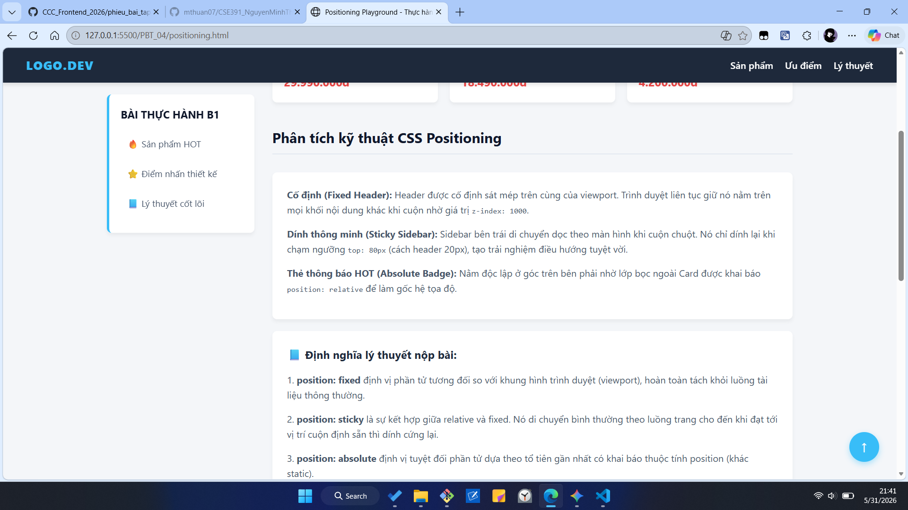
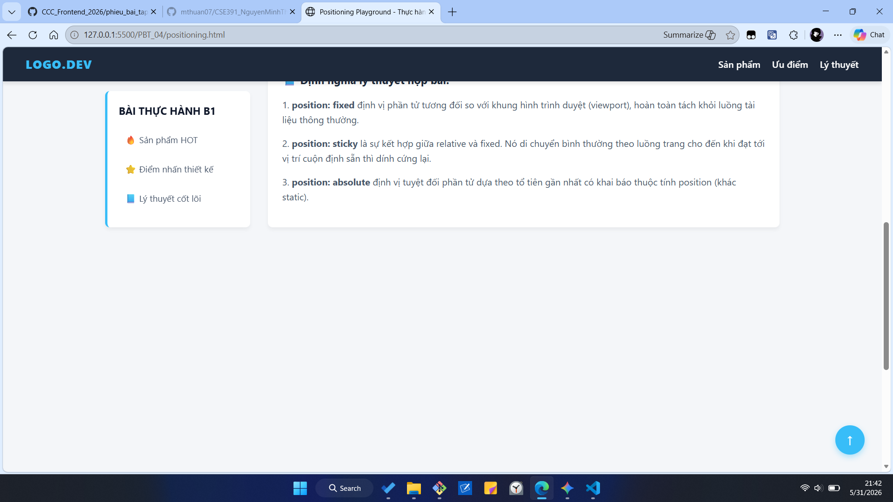
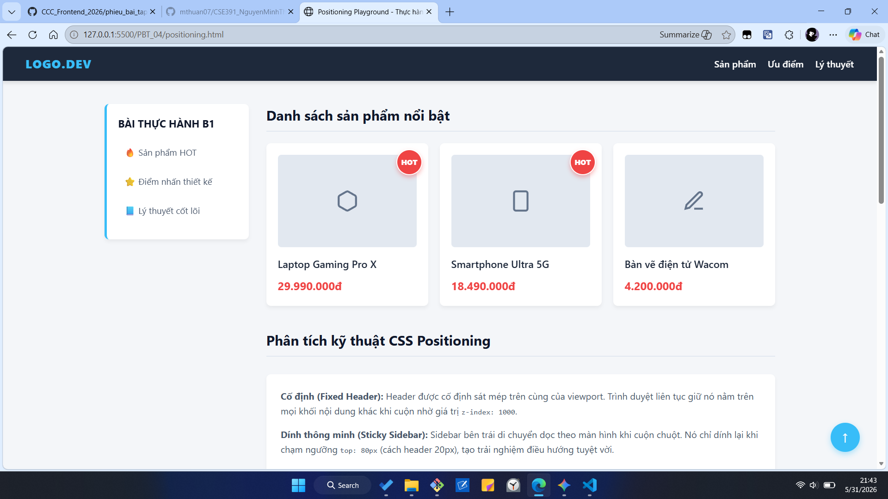

# Phần A

## CÂU A1 — 5 LOẠI POSITIONING

### 1. Bảng so sánh 5 thuộc tính Position trong CSS:

| Position | Vẫn chiếm chỗ trong flow? | Tham chiếu vị trí | Cuộn theo trang? | Use cases (Trường hợp sử dụng) |
| :--- | :--- | :--- | :--- | :--- |
| **static** | Có (Mặc định) | Theo luồng tự nhiên của văn bản | Có | Các phần tử văn bản, hình ảnh thông thường không cần dịch chuyển đặc biệt. |
| **relative** | Có | Vị trí ban đầu của chính nó | Có | Làm điểm tựa (gốc tọa độ) cho phần tử con dùng `absolute`; hoặc dịch chuyển nhẹ bằng top/left mà không làm xê dịch khối khác. |
| **absolute** | **Không** (Bị tách khỏi flow) | Phần tử tổ tiên gần nhất có position khác static | Có | Làm các icon thông báo trên góc ảnh, nút Close $(\times)$ của hộp thoại popup, hoặc các thẻ tag nhỏ nằm đè lên hình ảnh. |
| **fixed** | **Không** (Bị tách khỏi flow) | Khung hình trình duyệt (Viewport) | **Không** (Đứng yên một chỗ) | Thanh điều hướng (Navbar) luôn dính trên đỉnh đầu, nút "Cuộn lên đầu trang" hoặc hộp chat ở góc dưới màn hình. |
| **sticky** | Có (Khi chưa cuộn tới) $\rightarrow$ Không (Khi dính) | Luồng tự nhiên $\rightarrow$ Khung hình trình duyệt khi đạt điều kiện | Có | Tiêu đề của một bảng dữ liệu hoặc thanh danh mục chuyên mục (Sidebar) chạy dọc theo nội dung bài viết khi cuộn chuột. |

### 2. Trả lời câu hỏi thêm về Absolute Positioning:

* **Khái niệm "nearest positioned ancestor" (Tổ tiên được định vị gần nhất):** Có nghĩa là khi một phần tử được đặt `position: absolute`, trình duyệt sẽ lội ngược dòng lên các phần tử bọc bên ngoài nó (cha, ông, cố...) để tìm phần tử đầu tiên có thuộc tính `position` được cấu hình là một trong các giá trị: `relative`, `absolute`, `fixed`, hoặc `sticky` (tức là khác `static`).
* **Khi nào `absolute` tham chiếu parent?** Khi phần tử cha trực tiếp (parent) của nó được thiết lập thuộc tính `position: relative` (hoặc absolute/fixed/sticky). Lúc này, tọa độ `top: 0; left: 0;` của con sẽ nằm khít ở góc trên bên trái của cha.
* **Khi nào `absolute` tham chiếu body?** Khi tất cả các phần tử tổ tiên bao bọc bên ngoài nó đều **không** khai báo thuộc tính position (hoặc chỉ mang giá trị mặc định là `static`). Khi không tìm được điểm tựa nào, phần tử `absolute` sẽ lội ngược lên tận cùng và lấy khung chứa ban đầu của trang web (gốc tọa độ của thẻ `<body>` hoặc `<html>`) làm điểm tựa để tính toán vị trí.

---

## CÂU A2 — FLEXBOX VS GRID (DỰ ĐOÁN BỐ CỤC)

### /* Trường hợp 1 */
* **Bố cục:** 4 items nằm trên 1 hàng duy nhất. Chiều rộng của 4 items bằng nhau tuyệt đối (mỗi item chiếm đúng 25% chiều rộng của container) và chúng tự động co giãn để chia đều 100% không gian nhờ thuộc tính `flex: 1`.
* **Sơ đồ bố cục:**
```text
+-----------------------------------------------------------+
| [ Item 1 (25%) ] [ Item 2 (25%) ] [ Item 3 (25%) ] [ Item 4 (25%) ] |
+-----------------------------------------------------------+
```

### /* Trường hợp 2 */
* **Bố cục:** Gồm 3 hàng và 2 cột (tổng cộng 6 items). Do có thuộc tính `flex-wrap: wrap`, các item được phép rớt dòng khi hết chỗ. Mỗi item rộng 45% cộng với lề margin hai bên là 5% (tổng cộng 50% cho một item), vì vậy mỗi hàng chỉ chứa vừa khít đúng 2 items.
* **Sơ đồ bố cục:**
```text
+-----------------------------------------------------------+
|  [   Item 1 (45%)   ]           [   Item 2 (45%)   ]      |
|  [   Item 3 (45%)   ]           [   Item 4 (45%)   ]      |
|  [   Item 5 (45%)   ]           [   Item 6 (45%)   ]      |
+-----------------------------------------------------------+
```

### /* Trường hợp 3 */
* **Bố cục:** 3 items nằm trên 1 hàng duy nhất. Nhờ thuộc tính `justify-content: space-between`, Item 1 sẽ nằm dính sát vào lề bên trái, Item 3 dính sát vào lề bên phải, và Item 2 tự động căn vào chính giữa hàng. Thuộc tính `align-items: center` giúp cả 3 items được căn đều ở giữa theo chiều dọc (chiều cao) của khung chứa.
* **Sơ đồ bố cục:**
```text
+-----------------------------------------------------------+
| [Item 1]                 [Item 2]                 [Item 3]| -> (Căn giữa dọc)
+-----------------------------------------------------------+
```

### /* Trường hợp 4 */
* **Bố cục:** Gồm 1 hàng và 3 cột. Cột bên trái cố định kích thước 200px, cột bên phải cố định kích thước 200px. Cột ở giữa sử dụng đơn vị `1fr` nên sẽ tự động kéo giãn để chiếm trọn toàn bộ không gian còn lại ở giữa sau khi đã trừ đi kích thước hai cột hai bên và khoảng cách gap (20px).
* **Sơ đồ bố cục:**
```text
+-----------------------------------------------------------+
| [Col Left: 200px] |gap| [Col Center: 1fr] |gap| [Col Right: 200px] |
+-----------------------------------------------------------+
```

### /* Trường hợp 5 */
* **Bố cục:** Layout dạng lưới được chia cố định thành 3 cột bằng nhau nhờ lệnh `repeat(3, 1fr)`. Với tổng số 7 items, chúng sẽ được tự động xếp đều thành 3 hàng:
  * Hàng 1: Chứa Item 1, Item 2, Item 3.
  * Hàng 2: Chứa Item 4, Item 5, Item 6.
  * Hàng 3: Chỉ chứa duy nhất một mình Item 7 nằm ở ô đầu tiên bên trái (Cột 1). Hai ô còn lại của hàng này (Cột 2 và Cột 3) sẽ hoàn toàn để trống rỗng.
* **Sơ đồ bố cục:**
```text
+-----------------------------------------------------------+
| [  Item 1 (1fr)  ]    [  Item 2 (1fr)  ]    [  Item 3 (1fr)  ] |
| [  Item 4 (1fr)  ]    [  Item 5 (1fr)  ]    [  Item 6 (1fr)  ] |
| [  Item 7 (1fr)  ]    (Trống rỗng)          (Trống rỗng)       |
+-----------------------------------------------------------+
```


---

## 2. Các bước tiếp theo

Sau khi Thuận nhấn Copy khối mã bên trên và dán vào file thành công:
1. Lưu file `answers.md` lại (`Ctrl + S`).
2. Chạy lần lượt 3 câu lệnh Git thần thánh ở Git Bash để đẩy bài tập lên:
   ```bash
   git add .
   git commit -m "Hoàn thành toàn bộ câu trả lời Flexbox và Grid"
   git push
``

### Phần B
## Câu B1
# ảnh minh chứng 1

# ảnh minh chứng 2

# ảnh minh chứng 3



