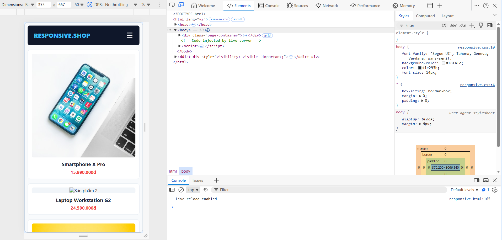
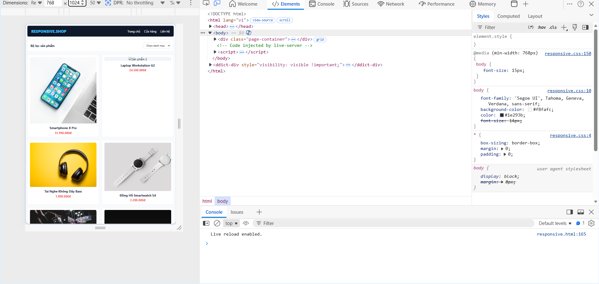
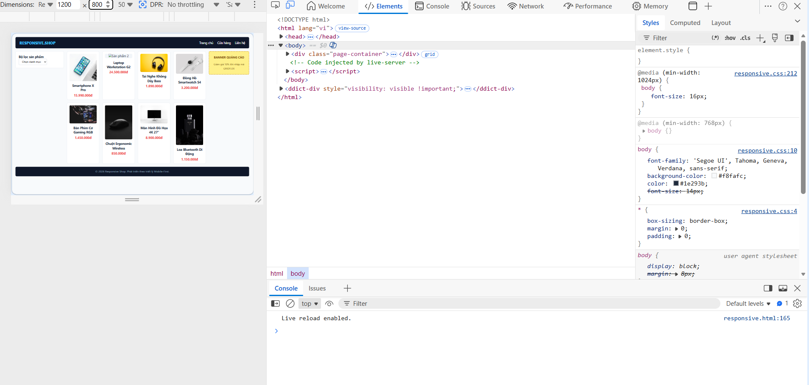

### Phần A
# PHẦN A — RESPONSIVE WEB DESIGN & SCSS BASICS

## CÂU A1 — VIEWPORT & MOBILE-FIRST

### 1. Thẻ meta viewport chuẩn và ý nghĩa các thuộc tính:
Thẻ chuẩn: <meta name="viewport" content="width=device-width, initial-scale=1.0">

* width=device-width: Ép chiều rộng của vùng nhìn (viewport) trên trình duyệt phải bằng chính xác với chiều rộng màn hình thực tế của thiết bị vật lý (ví dụ: iPhone 13 Pro là 390px, thay vì mặc định 980px).
* initial-scale=1.0: Thiết lập mức độ thu phóng (zoom) ban đầu của trang web là 1:1 ngay khi vừa tải xong, ngăn không cho trình duyệt tự động phóng to hay thu nhỏ nội dung.

### 2. Hiện tượng hiển thị trên iPhone nếu THIẾU thẻ này:
Nếu không có thẻ meta viewport, iPhone và các thiết bị di động nói chung sẽ hành xử theo cơ chế tương thích ngược: Nó sẽ coi trang web giống như đang chạy trên một màn hình máy tính Desktop có chiều rộng mặc định là 980px. Trình duyệt di động sau đó sẽ tự động thu nhỏ toàn bộ giao diện (zoom out) lại để nhét vừa khít khung màn hình điện thoại nhỏ bé. Kết quả là chữ nghĩa, hình ảnh, nút bấm sẽ biến thành tí hon, siêu nhỏ và người dùng bắt buộc phải dùng hai ngón tay để phóng to (pinch-to-zoom) mới đọc được nội dung.

### 3. Phân biệt Mobile-First và Desktop-First:

* Mobile-First: Viết CSS cho màn hình nhỏ (Mobile) trước, sau đó dùng min-width để đắp thêm code cho màn hình lớn hơn. Thường sử dụng @media (min-width: ...).
* Desktop-First: Viết CSS cho màn hình lớn (Desktop) trước, sau đó dùng max-width để bóp nhỏ hoặc giấu bớt phần tử cho màn hình nhỏ. Thường sử dụng @media (max-width: ...).

* Ví dụ CSS Mobile-First (Breakpoint 768px):
/* Mặc định cho Mobile */
.sidebar { display: none; } 

/* Lên Tablet và Desktop mới hiện */
@media (min-width: 768px) {
    .sidebar { display: block; }
}

* Ví dụ CSS Desktop-First (Breakpoint 768px):
/* Mặc định cho Desktop */
.sidebar { display: block; }

/* Xuống Mobile thì ẩn đi */
@media (max-width: 767px) {
    .sidebar { display: none; }
}

### 4. Tại sao Mobile-First được khuyên dùng rộng rãi?
* Tối ưu hóa hiệu năng (Performance): Thiết bị di động có cấu hình yếu và mạng 3G/4G chậm hơn máy tính. Mobile-First giúp trình duyệt di động tải ít CSS nhất có thể (bỏ qua đống code phức tạp của Desktop), giúp trang web tải cực nhanh.
* Tư tư duy thiết kế tinh gọn: Ép nhà phát triển phải tập trung vào nội dung cốt lõi, quan trọng nhất của doanh nghiệp trước khi vẽ thêm các hiệu ứng rườm rà trên không gian rộng lớn của Desktop.

---

## CÂU A2 — BREAKPOINTS CHUẨN (THEO BOOTSTRAP 5)

* Kích thước < 576px (xs - Extra small): Thiết bị đại diện là Điện thoại dọc (iPhone, Samsung...). Lưới sản phẩm nên hiển thị: 1 cột (hoặc tối đa 2 cột nhỏ).
* Kích thước >= 576px (sm - Small): Thiết bị đại diện là Điện thoại xoay ngang. Lưới sản phẩm nên hiển thị: 2 cột.
* Kích thước >= 768px (md - Medium): Thiết bị đại diện là Máy tính bảng dọc (iPad, Tablet). Lưới sản phẩm nên hiển thị: 3 cột.
* Kích thước >= 992px (lg - Large): Thiết bị đại diện là Máy tính bảng ngang, Laptop nhỏ. Lưới sản phẩm nên hiển thị: 4 cột.
* Kích thước >= 1200px (xl - Extra large): Thiết bị đại diện là Màn hình máy tính Desktop tiêu chuẩn. Lưới sản phẩm nên hiển thị: 4 cột hoặc 5 cột.
* Kích thước >= 1400px (xxl - Extra extra large): Thiết bị đại diện là Màn hình PC kích thước lớn, TV. Lưới sản phẩm nên hiển thị: 6 cột.

---

## CÂU A3 — MEDIA QUERIES ANALYSIS

Dựa trên nguyên lý dòng chảy từ trên xuống của CSS, các quy tắc @media (min-width: ...) viết sau sẽ ghi đè quy tắc viết trước nếu màn hình đạt đủ điều kiện kích thước pixel.

| Chiều rộng màn hình | .container width thực tế nhận được | Giải thích |
| :--- | :---: | :--- |
| **375px** (iPhone SE) | **100%** | Nhỏ hơn 576px, ăn theo thuộc tính mặc định ở trên cùng. |
| **600px** | **540px** | Lớn hơn 576px nhưng nhỏ hơn 768px, nhận mốc quy định của min-width: 576px. |
| **800px** | **720px** | Lớn hơn 768px nhưng nhỏ hơn 992px, nhận mốc của min-width: 768px. |
| **1000px** | **960px** | Lớn hơn 992px nhưng nhỏ hơn 1200px, nhận mốc của min-width: 992px. |
| **1400px** | **1140px** | Lớn hơn 1200px, ăn theo quy tắc cuối cùng min-width: 1200px. |

---

## CÂU A4 — SCSS BASICS

### 1. Giải thích 4 tính năng chính của SCSS và ví dụ:

* Variables (Biến số): Cho phép lưu trữ các giá trị sử dụng nhiều lần (màu sắc, font chữ, độ rộng lề...) vào một cái tên thông qua ký hiệu $. Khi cần đổi màu toàn bộ hệ thống trang web, chỉ cần sửa giá trị ở một vị trí duy nhất.
Ví dụ:
$primary-color: #3498db;
.button { background-color: $primary-color; }

* Nesting (Viết lồng nhau): Cho phép viết các bộ chọn CSS lồng vào nhau tuân theo đúng cấu trúc hình cây của HTML, giúp code gọn gàng, dễ quản lý và tránh lặp lại tên class cha. Ký tự & đại diện cho chính class cha đó.
Ví dụ:
.navbar {
    background: #fff;
    .nav-item {
        color: #333;
        &:hover { color: blue; }
    }
}

* Mixins (Hàm tái sử dụng): Giống như một hàm trong lập trình, cho phép nhóm một đống các thuộc tính CSS lại với nhau (có thể truyền tham số) bằng từ khóa @mixin và gọi lại bằng từ khóa @include ở bất kỳ khối nào.
Ví dụ:
@mixin flex-center($direction) {
    display: flex;
    justify-content: center;
    align-items: center;
    flex-direction: $direction;
}
.box { @include flex-center(row); }

* @extend / Inheritance (Kế thừa): Cho phép một bộ chọn chia sẻ hoặc sử dụng lại toàn bộ các thuộc tính CSS của một bộ chọn khác đã viết trước đó thông qua từ khóa @extend, giúp giảm thiểu tối đa việc viết trùng lặp code.
Ví dụ:
.btn-base { padding: 10px; border-radius: 50%; }
.btn-success {
    @extend .btn-base;
    background-color: green;
}

### 2. Tại sao trình duyệt KHÔNG đọc được file .scss? Cần bước xử lý gì?
* Lý do: Các trình duyệt web (Chrome, Edge, Safari...) từ trước đến nay chỉ được thiết kế theo tiêu chuẩn của W3C để hiểu và thông dịch duy nhất mã CSS thuần túy. SCSS (Sassy CSS) bản chất là một ngôn ngữ tiền xử lý mở rộng (CSS Preprocessor) có cú pháp logic chứa biến, hàm, viết lồng nhau nên trình duyệt hoàn toàn mù tịt, không thể hiểu được.
* Bước xử lý bắt buộc: Chúng ta cần thực hiện một bước gọi là Biên dịch (Compile hoặc Transpile). Lập trình viên sẽ sử dụng các công cụ như extension Live Sass Compiler trên VS Code, hoặc chạy lệnh thông qua các thư viện như Node-Sass hay Dart-Sass để quét file .scss, phân tích cú pháp logic và xuất (render) ra một file .css truyền thống tương ứng cho trình duyệt đọc.

### Phần B
## Câu B1

# Ảnh 1

# Ảnh 2

# Ảnh 3


## Câu B3

### 1. Giải thích công cụ sử dụng:
Em sử dụng extension **Live Sass Compiler** (hoặc công cụ **Dart-Sass** qua NPM) trên phần mềm VS Code để thực hiện quá trình biên dịch tự động file `style.scss` thành file `style.css` truyền thống giúp trình duyệt đọc được.

### 2. Câu lệnh thực hiện biên dịch bằng Terminal:
Nếu thực hiện biên dịch thủ công thông qua command line (giao diện dòng lệnh), câu lệnh chuẩn được sử dụng là:
```bash
sass style.scss style.css --watch

